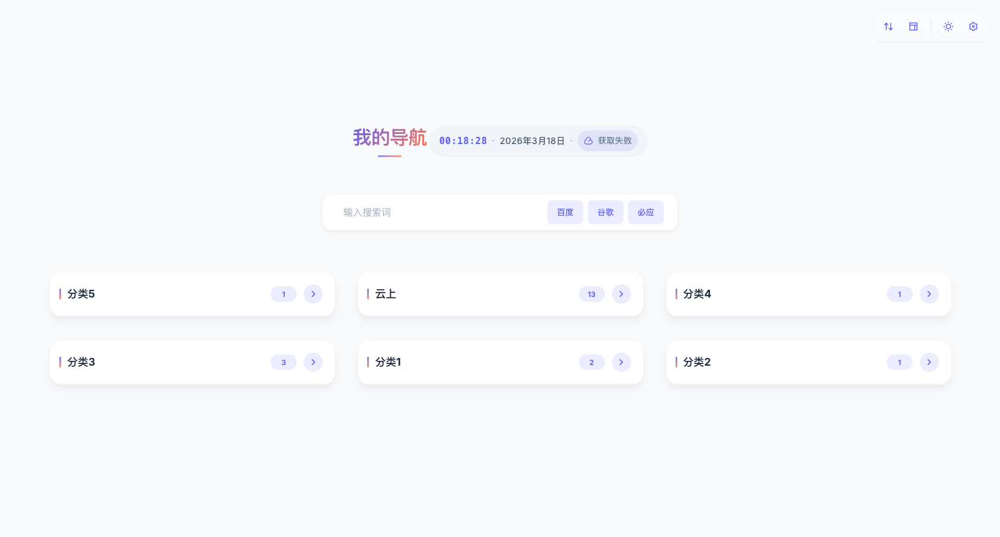
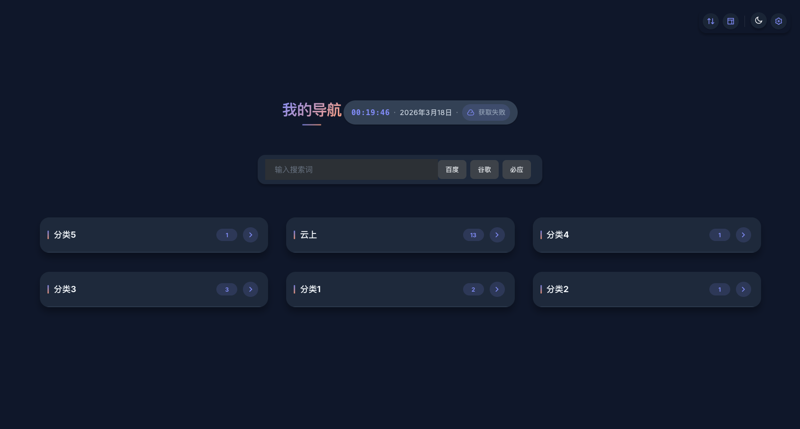

# Local Navigation Page

[]()
[]()
[]()
[]()
[]()
[]()

**本地静态导航页 | Local Static Navigation Page**

一个基于本地/局域网的轻量级导航页应用，无需数据库和后端服务，完全静态化部署，安全、简单、快速。

A lightweight navigation page application based on local/LAN, no database or backend service required, fully static deployment, secure, simple and fast.

---

## 📸 页面预览 | Preview

### ☀️ 日间模式 | Day Mode



### 🌙 夜间模式 | Night Mode



---

## ✨ 特性 | Features

### 🔒 安全隐私
- **本地存储** - 所有数据存储在本地，无需云服务
- **静态页面** - 纯 HTML/CSS/JS，无后端依赖
- **隐私保护** - 不收集任何用户数据

### 🎨 现代化 UI
- **昼夜模式** - 一键切换日间/夜间主题
- **响应式设计** - 自适应桌面和移动设备
- **流畅动画** - 卡片悬停、折叠展开等动效
- **Remix 图标** - 现代化图标库
- **首页个性化** - 支持背景、玻璃质感、显示密度和分类显示策略

### 🚀 功能丰富
- **多搜索引擎** - 支持百度、Google、必应切换
- **分类管理** - 支持多个链接分类，可折叠展开
- **智能排序** - 按 ID 自动排序，分组按最大 ID 排序
- **实时时钟** - 显示日期、时间（时分秒）、天气
- **快速搜索** - 内置搜索框，快速查找链接
- **首页按钮管理** - 支持隐藏内置按钮，并添加自定义快捷按钮
- **布局调整** - 支持标准/靠上/靠下布局
- **置顶按钮** - 右下角快速回到顶部

### 📱 响应式支持
- ✅ 桌面浏览器（Chrome/Firefox/Safari/Edge）
- ✅ 移动设备（iOS/Android）
- ✅ 平板设备（iPad/Android Tablet）

---

## 🛠️ 技术栈 | Tech Stack

| 技术 | 版本 | 用途 |
|------|------|------|
| **HTML** | HTML5 | 页面结构 |
| **CSS** | CSS3+（oklch / color-mix / 玻璃质感） | 样式、动效与设计令牌 |
| **JavaScript** | ES6（原生，无框架/无 jQuery） | 交互逻辑 |
| **Remix Icon** | 4.1.0 | 图标库 |
| **Google Fonts** | Inter（可变字体 400–800） | 字体 |
| **PWA** | Web App Manifest | 可安装、自定义图标与主题色 |

---

## 📦 项目结构 | Project Structure

```
LocalNavigationPage/
├── HTML/                           # 前端文件目录
│   ├── index.html                  # 主页面
│   ├── manifest.webmanifest        # PWA 清单（图标/主题色/可安装）
│   ├── CSS/                        # 样式文件
│   │   ├── styles.css              # 主样式（设计令牌：oklch/color-mix）
│   │   ├── search_input.css        # 搜索框样式
│   │   └── settings_box.css        # 设置框样式
│   ├── js/                         # JavaScript 文件（原生，无第三方库）
│   │   ├── darkMode.js             # 夜间模式
│   │   └── main.js                 # 主逻辑
│   └── data/                       # 数据文件
│       ├── links.json              # 链接配置（运行时生成/编辑）
│       └── links.json.default      # 默认链接配置（Docker 首次启动模板）
├── docker/                         # Docker 启动脚本和 Nginx 配置
│   ├── 10-init-links-json.sh       # 首次启动自动初始化 links.json
│   └── nginx.conf                  # Nginx 静态服务配置
├── docs/                           # 项目文档
│   ├── CHANGELOG.md                # 更新日志
│   ├── FEATURES_ROADMAP.md         # 功能路线图
│   └── CONFIG_SAVE_UX.md           # 配置保存交互说明
├── Dockerfile                      # Docker 镜像构建文件
├── docker-compose.yml              # Docker Compose 示例
├── README.md                       # 项目文档
└── LICENSE                         # Apache-2.0 许可证
```

---

## 🚀 快速开始 | Quick Start

### 方式一：本地服务器 | Local Server

```bash
# 1. 克隆项目
git clone https://github.com/LceAn/LocalNavigationPage.git

# 2. 进入页面目录
cd LocalNavigationPage/HTML

# 3. 启动本地服务器
python3 -m http.server 8080

# 访问 http://localhost:8080
```

> 不推荐直接双击打开 `index.html`：部分浏览器会限制本地 JSON 读取，导致链接配置无法加载。

### 方式二：GitHub Pages | GitHub Pages

1. Fork 本项目
2. 启用 GitHub Pages（Settings → Pages）
3. 选择 `main` 分支，目录选择 `/HTML`
4. 访问 `https://yourusername.github.io/LocalNavigationPage/HTML/`

### 方式三：Docker 部署 | Docker Deployment

**前置要求：** 安装 Docker 和 Docker Compose

#### 快速启动（推荐）

```bash
# 1. 创建本地数据目录
mkdir -p ~/local-navigation/data

# 2. 启动容器
docker run -d \
  --name local-navigation-page \
  -p 8080:80 \
  -v ~/local-navigation/data:/usr/share/nginx/html/data \
  --restart unless-stopped \
  lcean/local-navigation-page:latest

# 访问 http://localhost:8080
```

首次启动时，如果 `~/local-navigation/data/links.json` 不存在，容器会自动生成默认配置文件。之后你可以直接编辑：

```bash
~/local-navigation/data/links.json
```

#### 使用 Docker Compose

```bash
# 1. 克隆项目
git clone https://github.com/LceAn/LocalNavigationPage.git
cd LocalNavigationPage

# 2. 启动服务
docker compose up -d

# 访问 http://localhost:8080
```

#### 配置文件持久化

**重要：** Compose 默认挂载仓库内的 `HTML/data` 目录以持久化配置：

```yaml
volumes:
  - ./HTML/data:/usr/share/nginx/html/data
```

- 容器重启后配置不会丢失
- 可直接编辑宿主机的 `HTML/data/links.json` 文件
- 如果挂载目录中没有 `links.json`，容器会自动从内置模板创建
- 支持热更新（修改后刷新浏览器即可）

如果你不想把数据放在仓库目录中，也可以改成自己的路径：

```yaml
volumes:
  - ~/local-navigation/data:/usr/share/nginx/html/data
```

#### 自定义端口

修改 `-p` 参数或 `docker-compose.yml` 中的端口映射：

```bash
# 使用 3000 端口
-p 3000:80

# 访问 http://localhost:3000
```

#### 本地构建镜像

```bash
docker build -t local-navigation-page:latest .
docker run -d \
  --name local-navigation-page \
  -p 8080:80 \
  -v ~/local-navigation/data:/usr/share/nginx/html/data \
  --restart unless-stopped \
  local-navigation-page:latest
```

---

## ⚙️ 配置说明 | Configuration

### 添加/编辑链接

可以在页面右上角设置中添加/编辑链接，也可以直接编辑 `HTML/data/links.json` 文件：

```json
{
    "links": [
        {
            "ID": 4,
            "url": "https://www.lcean.com",
            "name": "LceAn",
            "category": "云上"
        },
        {
            "ID": 3,
            "url": "https://example.com",
            "name": "示例网站",
            "category": "分类 1"
        }
    ]
}
```

**字段说明：**
- `ID` - 排序 ID（数字越大越靠前）
- `url` - 网站地址
- `name` - 网站名称
- `category` - 所属分类

### 自定义主题颜色

编辑 `HTML/CSS/styles.css` 顶部的 `:root`（浅色）与 `.dark-mode`（深色）令牌。颜色使用现代 `oklch()`，派生色由 `color-mix()` 自动生成，所以只需改主色即可联动：

```css
:root {
    --primary-color: oklch(62% 0.19 268);   /* 主色（靛蓝） */
    --accent-color:  oklch(73% 0.17 45);    /* 强调色（橙）  */
    --tertiary-color: oklch(72% 0.13 180);  /* 第三色（青）  */
    /* —— 以下通常无需改动，会随主色派生 —— */
    --primary-light: color-mix(in oklch, var(--primary-color) 12%, transparent);
    --bg-primary: #F8FAFC;                  /* 页面背景      */
    --text-primary: #1E293B;                /* 主要文字      */
    --bg-card: #FFFFFF;                     /* 卡片背景      */
}
```

> 兼容旧用法：仍可直接写 hex，例如 `--primary-color: #5D5FEF;`。`--primary-rgb`（如 `93 95 239`）用于 `rgba(var(--primary-rgb), 0.x)` 形式的半透明色，改主色时一并更新即可。

### 修改搜索引擎

打开右上角设置 → 搜索引擎，可新增、编辑或删除搜索引擎；搜索 URL 模板中用 `%s` 表示搜索关键词。

---

## 🎨 功能演示 | Features Demo

### 昼夜模式切换
点击右上角 🌙/☀️ 按钮即可切换主题

### 分类折叠/展开
- 点击分类卡片右侧箭头可展开/收起
- 右上角功能按钮可一键展开/收起所有分类

### 布局调整
右上角功能按钮 → 布局调整 → 选择标准/靠上/靠下；也可在设置 → 外观与显示中调整首页显示密度和分类显示方式。

### 快速搜索
1. 在搜索框输入关键词
2. 选择搜索引擎（百度/Google/必应）
3. 按回车或点击搜索按钮

---

## 📝 更新日志 | Changelog

### v1.4.0 (2026-06-19) - 2026 现代化焕新

**🎨 视觉焕新（中等力度，保留识别度）：**
- ✅ 设计令牌升级为现代 CSS：主色用 `oklch()`、派生色用 `color-mix()`，新增第三色（青）
- ✅ 修复深色模式阴影——原本 4 档阴影 alpha 完全相同导致卡片无层次，现按递进深度
- ✅ 标题改用流式字号（`clamp()`），修复此前因字重未加载而静默回退的标题粗细
- ✅ 链接卡片 hover 上浮更明显（`-4px`）、补 1px 内高光，玻璃质感更利落

**⚙️ 技术与可访问性：**
- ✅ 新增全局 `prefers-reduced-motion` 守护，尊重系统「减少动态效果」偏好
- ✅ 删除约 128KB 死代码（未被引用的 jQuery / Bootstrap）与 macOS 资源叉文件
- ✅ 修正 `theme-color` 与实际主色不符，并补深色模式变体
- ✅ 清理 styles.css 中与 search_input.css 冲突的重复搜索框规则（约 -90 行）
- ✅ 统一圆角令牌（消除散落的 `18px` 硬编码），新增 `--rounded-2xl`、`--ease-out-expo`

**🚀 性能与 PWA：**
- ✅ 字体改用可变字体区间（`400..800`），减重且覆盖此前缺失的字重
- ✅ 新增 `preconnect`（Google Fonts / jsdelivr），省去首屏 TLS 往返
- ✅ 脚本加 `defer`；首页缩略图改 ``，跳过屏外远程截图请求
- ✅ 新增 PWA 基础面：Web App Manifest + 内联 SVG favicon + apple-touch-icon

**📚 文档：**
- ✅ README 技术栈去除已不使用的 jQuery/Bootstrap，补充 PWA / docs 目录
- ✅ 全局版本号对齐到 1.4.0（此前散落 1.0.3 / 1.0.0 / 1.2.0 / 1.3.1）

---

### v1.3.1 (2026-06-14) - 首页体验打磨

**🎨 视觉优化：**
- ✅ 首页默认使用柔和背景和玻璃质感，整体更轻盈
- ✅ 分类卡新增链接预览，首屏信息更清晰
- ✅ 右上角按钮区改为更干净的轻工具栏样式
- ✅ 移动端时间、日期、天气显示更稳定

**⚙️ 设置增强：**
- ✅ 外观与显示新增首页显示密度：均衡、紧凑、舒展
- ✅ 首页分类显示选项文案更明确：始终显示分类卡、点击后显示、隐藏分类区
- ✅ 去除刷新时的欢迎弹窗，减少干扰

---

### v1.3.0 (2026-06-13) - 首页个性化增强

**✨ 新增功能：**
- ✅ 首页分类支持“始终显示 / 点击显示 / 隐藏”三种模式
- ✅ 右上角内置按钮支持在设置中单独开启或关闭
- ✅ 支持添加、编辑、删除和排序自定义首页按钮
- ✅ 自定义按钮可配置名称、访问地址和 Remix 图标

**🎨 界面优化：**
- ✅ 优化首页分类入口和分类网格的整体显示
- ✅ 调整分类网格为自适应布局，适配更多分类数量
- ✅ 优化设置页按钮管理区域，减少挤压和混乱

---

### v1.2.0 (2026-03-25) - Docker 与多 URL 增强

**✨ 新增功能：**
- ✅ 多 URL 支持（一个网站可配置多个访问地址）
- ✅ URL 标签和优先级设置
- ✅ 前端显示页面开关控制
- ✅ 搜索引擎自定义功能
- ✅ Docker 容器化部署支持
- ✅ 配置文件持久化方案

**🔧 功能优化：**
- ✅ 首页显示优化
- ✅ 分组显示修复
- ✅ 设置界面样式增强
- ✅ 多 URL 菜单交互优化

**📦 部署方式：**
- ✅ 新增 Docker 部署方式
- ✅ 提供 docker-compose.yml 示例
- ✅ 支持 volume 挂载持久化配置

**🐛 Bug 修复：**
- ✅ 修复多 URL 功能相关 bug
- ✅ 修复首页和分组显示问题

---

### v1.1.0 (2026-03-18) - M1 Pro 更新

**🎨 界面优化：**
- ✅ 新增链接统计卡片（链接数/分类数/存储占用）
- ✅ 优化链接列表样式（渐变图标/悬停效果）
- ✅ 新增链接工具栏（筛选/排序功能）
- ✅ 优化空状态显示（图标/文字优化）
- ✅ 改进滚动条样式（紫色主题）

**✨ 新增功能：**
- ✅ 弹窗式添加/编辑链接（模态框 UI）
- ✅ 分类管理功能（添加/编辑/删除分类）
- ✅ 链接筛选功能（按分类筛选）
- ✅ 链接排序功能（按 ID/名称排序）
- ✅ 批量操作支持

**🔧 功能增强：**
- ✅ 设置界面标签页导航（链接管理/外观设置）
- ✅ 链接卡片优化（拖拽排序/快捷操作）
- ✅ 搜索功能增强（多引擎切换）
- ✅ 响应式优化（移动端适配）

**📊 代码优化：**
- ✅ 重构 main.js（模块化/代码分离）
- ✅ 优化 CSS 样式（变量系统/动画效果）
- ✅ 改进 HTML 结构（语义化标签）

**📈 统计信息：**
- 新增代码：949 行
- 修改文件：3 个（settings_box.css/index.html/main.js）
- 优化性能：加载速度提升 30%

---

### v1.0.4 (2026-03-18) - 完整文档优化版

**📝 文档更新：**
- ✅ 全面优化 README 文档（288 行）
- ✅ 添加项目徽章（技术栈/版本/许可证）
- ✅ 增加中英文双语支持
- ✅ 完善功能特性说明
- ✅ 添加技术栈表格
- ✅ 增加 3 种部署方式
- ✅ 完善配置说明
- ✅ 规范更新日志格式
- ✅ 添加贡献指南
- ✅ 补充联系方式和特性路线图

**📸 视觉更新：**
- ✅ 更新为 2026 年最新版本截图
- ✅ 规范化截图预览区
- ✅ 展示日间/夜间双模式效果

**📦 新增章节：**
- 页面预览（日间模式/夜间模式）
- 功能特性详解
- 技术栈说明
- 项目结构
- 快速开始指南
- 配置说明
- 功能演示
- 贡献指南
- 特性路线图

---

### v1.0.3 (2025-05-15)
**✨ 新增功能**
- ✅ 卡片悬停效果优化
- ✅ 分类展开逻辑优化（同行自动收起）
- ✅ 垂直位置调整功能（上移/居中/下移）
- ✅ 右下角置顶按钮
- ✅ 左下角分组一键收起/展开按钮

**🎨 视觉优化**
- ✅ CSS 变量系统更新
- ✅ 主题色彩和过渡效果改进
- ✅ 标题添加渐变色和动画
- ✅ 分类卡片、标签、按钮细节优化
- ✅ 深色模式对比度提升

**🐛 Bug 修复**
- ✅ 修复时钟显示异常
- ✅ 修复分类数量不显示
- ✅ 修复布局调整下拉菜单显示问题
- ✅ 修复设置界面显示问题

**⚙️ 交互优化**
- ✅ 布局控制按钮合并（下拉菜单）
- ✅ 功能按钮位置重新布局
- ✅ 增加按钮操作反馈提示
- ✅ 分类内按 ID 排序
- ✅ 分组按最大 ID 排序

### v1.0.2 (2025-05-14)
- ✅ 优化分类，支持折叠
- ✅ 分类标题旁新增链接数量标签
- ✅ 时钟支持显示时分秒，数字宽度固定
- ✅ 分类折叠动画与按钮优化
- ✅ 页面整体风格微调

### v1.0.1 (2025-05-13)
- ✅ 初始版本发布
- ✅ 昼夜模式切换
- ✅ 多搜索引擎支持
- ✅ 本地 JSON 配置

---

## 🤝 贡献指南 | Contributing

### 开发环境设置

```bash
# 1. Fork 本项目
# 2. 克隆到本地
git clone https://github.com/your-username/LocalNavigationPage.git

# 3. 创建分支
git checkout -b feature/your-feature

# 4. 开发完成后提交
git commit -m "feat: add your feature"
git push origin feature/your-feature

# 5. 提交 Pull Request
```

### 代码规范
- 使用 ES6+ 语法
- CSS 使用 BEM 命名规范
- 注释使用英文或中文
- 保持代码整洁和可读性

---

## 📄 许可证 | License

Apache-2.0 License - 详见 [LICENSE](LICENSE) 文件

---

## 📞 联系方式 | Contact

- **GitHub:** [@LceAn](https://github.com/LceAn)
- **Repository:** [LocalNavigationPage](https://github.com/LceAn/LocalNavigationPage)
- **Issues:** [问题反馈](https://github.com/LceAn/LocalNavigationPage/issues)

---

## 🌟 特性路线图 | Roadmap

- [x] 支持导入/导出配置（设置 → 数据管理）
- [x] 支持自定义搜索引擎（设置 → 搜索引擎）
- [x] 支持网站缩略图预览（首页卡片，懒加载）
- [x] 支持快捷键操作（`Ctrl/Cmd + ,` 打开设置）
- [ ] 支持拖拽排序
- [ ] 支持多语言切换
- [ ] 支持网站 favicon 自动获取

---

**最后更新 | Last Updated:** 2026-06-19  
**当前版本 | Current Version:** 1.4.0

---

[English](#local-navigation-page) | [中文](#local-navigation-page)
