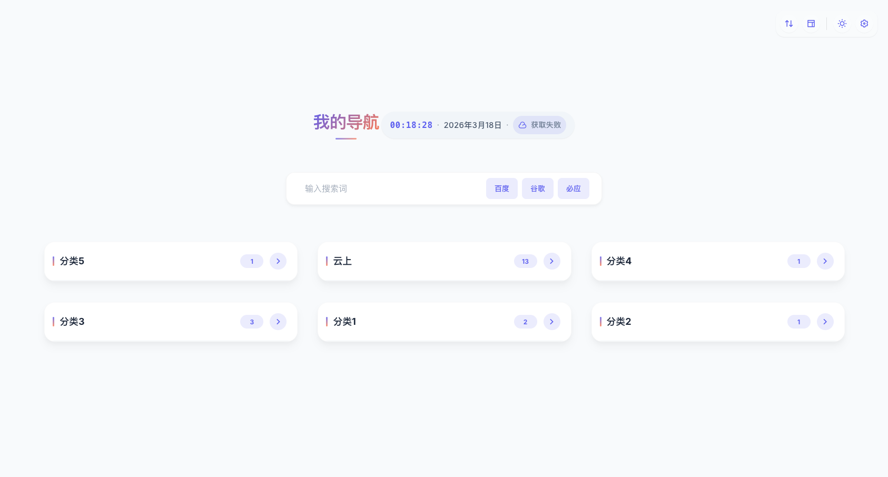

# Local Navigation Page

[]()
[]()
[]()
[]()
[]()
[]()

纯 HTML、CSS 和 JavaScript 实现的本地导航页，支持图标磁贴分组、多地址链接、搜索、主题切换、浏览器内编辑、导入导出、PWA 清单和 Docker 静态部署。字体与图标已本地化，断网或纯内网环境界面完整可用（仅网站缩略图/favicon 需要外网）。



## 快速开始

使用内置零依赖服务器（需要 Node.js 18+）：

```bash
git clone https://github.com/LceAn/LocalNavigationPage.git
cd LocalNavigationPage
npm run serve
```

或使用 Python 静态服务器：

```bash
git clone https://github.com/LceAn/LocalNavigationPage.git
cd LocalNavigationPage/HTML
python3 -m http.server 8080
```

访问 `http://127.0.0.1:8080`。不建议直接双击 `index.html`，浏览器可能阻止读取 `data/links.json`。

Docker Compose：

```bash
git clone https://github.com/LceAn/LocalNavigationPage.git
cd LocalNavigationPage
docker compose up -d --build
```

默认访问 `http://127.0.0.1:8080`。Compose 将 `HTML/data` 挂载到容器；首次启动缺少 `links.json` 时，入口脚本会从安全示例创建。

## 链接数据

`HTML/data/links.json.default` 是 Docker 初始化模板，`HTML/data/links.json` 是静态部署需要的公开示例。两者在仓库中必须保持一致，防止误把私人管理地址提交到 Git。

页面中的编辑结果主要保存在浏览器 `localStorage`。私有地址建议通过页面导入/导出管理，或放在仓库外的 Docker 数据卷中。提交前运行验证命令确认示例没有被替换；本地开发若临时使用私有 `links.json`，可用 `LNP_ALLOW_PRIVATE_LINKS=1 npm run validate` 跳过该项检查（切勿提交私有数据）。

一个链接可以使用单个 `url`，也可以使用多个带标签和优先级的 `urls`：

```json
{
  "ID": 2,
  "name": "NAS 管理",
  "category": "存储",
  "urls": [
    { "address": "http://192.168.1.100:5000", "label": "本地", "priority": 1 },
    { "address": "https://your-host.example.com", "label": "远程", "priority": 2 }
  ]
}
```

只允许 `http` 和 `https` 示例地址。页面打开链接前还会执行协议校验。

## 自定义

### 修改主题色

编辑 `HTML/CSS/styles.css` 顶部的 `:root`（浅色）与 `.dark-mode`（深色）令牌。颜色使用现代 `oklch()`，派生色由 `color-mix()` 自动生成，所以只需改主色即可联动：

```css
:root {
    --primary-color: oklch(62% 0.19 268);   /* 主色（靛蓝） */
    --accent-color:  oklch(73% 0.17 45);    /* 强调色（橙）  */
    --tertiary-color: oklch(72% 0.13 180);  /* 第三色（青）  */
    /* —— 以下通常无需改动，会随主色派生 —— */
    --primary-light: color-mix(in oklch, var(--primary-color) 12%, transparent);
    --bg-primary: #F8FAFC;                  /* 页面背景      */
    --text-primary: #1E293B;                /* 主要文字      */
    --bg-card: #FFFFFF;                     /* 卡片背景      */
}
```

> 兼容旧用法：仍可直接写 hex，例如 `--primary-color: #5D5FEF;`。`--primary-rgb`（如 `93 95 239`）用于 `rgba(var(--primary-rgb), 0.x)` 形式的半透明色，改主色时一并更新即可。

### 修改搜索引擎

打开右上角设置 → 搜索引擎，可新增、编辑或删除搜索引擎；搜索 URL 模板中用 `%s` 表示搜索关键词。

## 开发验证

需要 Node.js 18+，无需安装第三方包：

```bash
npm run validate
docker build --tag local-navigation-page:test .
```

验证范围包括：

- 两份链接 JSON 的格式、ID、必要字段和 URL 协议
- 公开运行配置与默认模板一致
- HTML 引用的本地资源存在且不越界
- JavaScript 和 Docker 初始化 Shell 脚本语法
- Docker 镜像可以构建

## 目录

- `HTML/index.html`：页面入口
- `HTML/js/main.js`：链接、搜索、设置、导入导出和状态探测
- `HTML/js/darkMode.js`：主题状态
- `HTML/CSS/`：页面样式
- `HTML/data/`：公开示例与 Docker 默认配置
- `docker/`：Nginx 配置和数据初始化脚本
- `docs/`：更新记录、交互说明和路线图

## 许可

本项目使用 [Apache License 2.0](LICENSE)。

<!-- repo-readme-standard:v1 -->
## 仓库维护信息

- 项目类型：静态网页工具
- 当前状态：维护中
- 可见性：public
- 维护节奏：按月检查浏览器兼容性、公开示例和 Docker 构建
- 相关仓库：与 `Navigation_Index` 都属于导航领域，但数据模型和产品边界不同，不建议直接合并
- 维护边界：公开前必须复核链接数据；归档、删除或历史重写需单独确认

## 特性路线图

- [x] 支持导入/导出配置（设置 → 数据管理）
- [x] 支持自定义搜索引擎（设置 → 搜索引擎）
- [x] 支持网站缩略图预览（首页卡片，懒加载）
- [x] 支持快捷键操作（`Ctrl/Cmd + ,` 打开设置）
- [ ] 支持拖拽排序
- [ ] 支持多语言切换
- [ ] 支持网站 favicon 自动获取

---

**最后更新：** 2026-06-27
**当前版本：** 1.5.0
